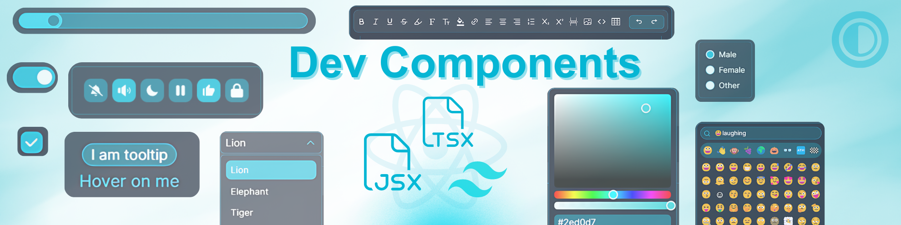

# Dev Components



🚀 Dev Components is a unique platform providing fully customizable React components in TSX/JSX, seamlessly styled with Tailwind CSS. Unlock productivity and efficiency with our ready-to-use, highly flexible UI elements.

## Our Philosophy

- **Minimal Dependencies**: We create components with little to no external dependencies, ensuring lightweight integration.
- **Best-of-Breed Options**: Some components offer variations inspired by renowned packages, giving you top-quality choices without the bloat.

## What Sets Us Apart

Dev Components isn't just another UI library. We specialize in highly functional React components that go beyond the surface:

- **TSX/JSX Flexibility**: Write your way, we support both.
- **Tailwind CSS Integration**: Beautiful, responsive designs out of the box.
- **Functional Power**: Our components aren't just pretty—they're smart.

## Why Choose Dev Components?

1. **Functionality First**: While others focus on looks, we prioritize powerful, feature-rich components that solve real development challenges.

2. **Customization King**: Tailor each component to your needs without breaking a sweat.

3. **Performance Driven**: Optimized for speed and efficiency, because every millisecond counts.

4. **TypeScript Love**: Full TypeScript support for rock-solid development.

5. **React or NextJS Ready**: Seamless integration with ReactJS as well as NextJS for modern web apps.

## How to Use

1. Visit our website: [Dev Components Website]
2. Browse our component library
3. Find a component you love
4. Copy the code directly from the preview
5. Paste into your project
6. Enjoy seamless functionality!

## Example Usage

After copying a component from our website, you can use it like this:

```jsx
import React from "react";
import DevModalV2 from "./dev-modal-v2";

const DevModalV2Usage = () => {
  return (
    <DevModalV2
      title="Dev Modal"
      modalBtn={
        <button className="bg-accentNeon p-2 px-4 rounded-md hover:opacity-80">
          Open Modal
        </button>
      }
    >
      <div className="flex flex-col gap-3">
        <p>
          Lorem ipsum dolor sit amet consectetur adipisicing elit. Harum nostrum
          magni quia enim, vel autem maiores. Beatae eveniet omnis nam non ab,
          quo suscipit repellat ratione enim delectus pariatur quos.
        </p>
      </div>
    </DevModalV2>
  );
};

export default DevModalV2Usage;
```
